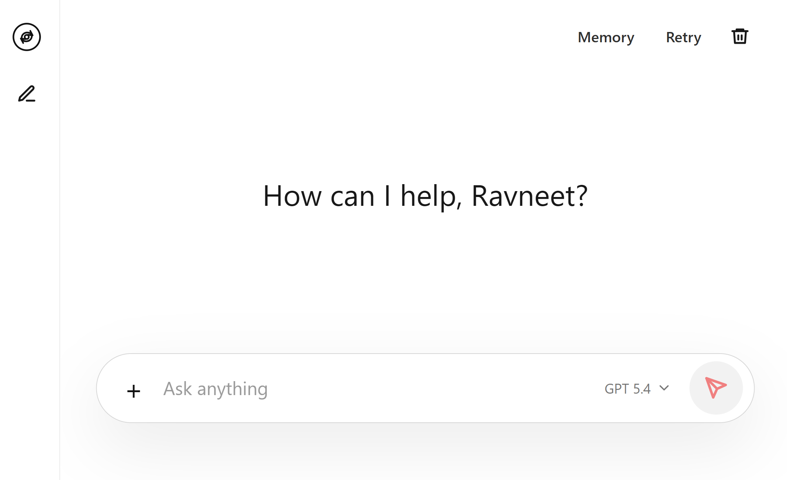
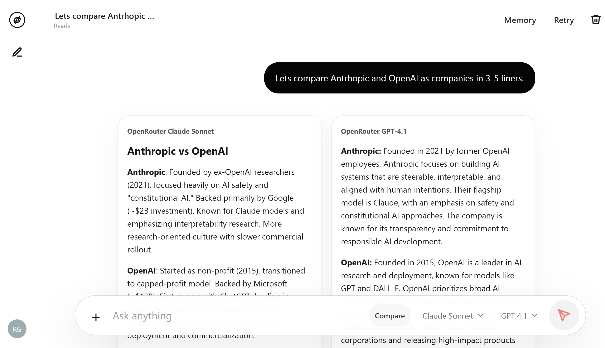

# OSS Conversation Agent



OSS Conversation Agent is a local-first ChatGPT-style conversation shell for building and testing modern AI assistants across provider APIs. It starts with OpenAI Responses API support and includes OpenRouter as a second provider path, while keeping the UI and backend provider-neutral.

The product is designed around the core expectations of a serious chat agent: streamed responses, model selection, attachment upload and review, per-chat memory, markdown rendering, retry/regenerate flows, and response actions for copying or exporting answers.

## Compare Mode



Compare mode lets one prompt run against two selected models at the same time. Each response streams into its own pane, so the user can compare tone, reasoning, markdown quality, and provider behavior without leaving the conversation. If one model fails, the other keeps streaming and the failed pane keeps any partial output with the provider error shown inline.

## Features

- Streaming assistant responses over server-sent events.
- Two-model Compare mode with parallel streaming response panes.
- Provider registry with dynamically refreshed OpenAI and OpenRouter model catalogs.
- Per-chat memory manager with inspectable and editable memory.
- File uploads with named attachment tiles and file-open links.
- OpenAI multimodal/file input support for images, PDFs, docs, text, code, CSV, and common office formats.
- OpenRouter image/text compatibility where supported by the selected model.
- Markdown rendering for headings, lists, links, code blocks, blockquotes, and tables.
- Response controls for copy, markdown download, and regenerate.
- Per-response input/output token usage when the provider returns usage data.
- Per-pane failure handling for provider errors during Compare mode.
- Dependency-free Node server and browser client.
- Local JSON persistence for conversations, messages, files, and memory.

## Run Locally

Create a local env file:

```powershell
Copy-Item .env.example .env
```

Add your `OPENAI_API_KEY` and/or `OPENROUTER_API_KEY` to `.env`.

Start the app:

```powershell
node src/server/index.js
```

Open:

```text
http://127.0.0.1:4613
```

If provider keys are not set, the app runs in demo streaming mode so the interface and persistence can still be tested.

## Run With Docker

Create `.env` from the example file and add any provider keys:

```powershell
Copy-Item .env.example .env
```

Build and start:

```powershell
docker compose up --build
```

Open:

```text
http://127.0.0.1:4613
```

Compose mounts `./data` and `./uploads` into the container so conversations and uploaded files persist across restarts.

## Provider Notes

OpenAI uses the Responses API and supports multimodal file input through the app's upload pipeline.

OpenRouter uses its OpenAI-compatible chat completions endpoint. Some models may reject attachments or multimodal content. When that happens, the app surfaces a user-friendly error built from the provider's actual response.

## Project Structure

```text
src/client/      Browser UI
src/server/      Node server, providers, memory, uploads
docs/            Product imagery and docs assets
data/            Local runtime persistence, ignored
uploads/         Local uploaded files, ignored
```

## Status

This is an early product build intended for fast local iteration. The current implementation deliberately keeps dependencies low while the core product surface is being shaped.
