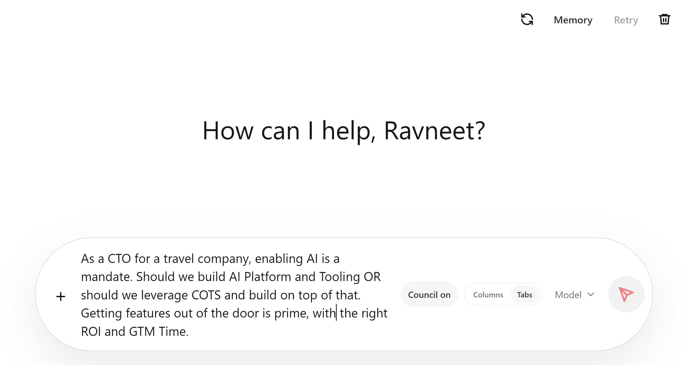
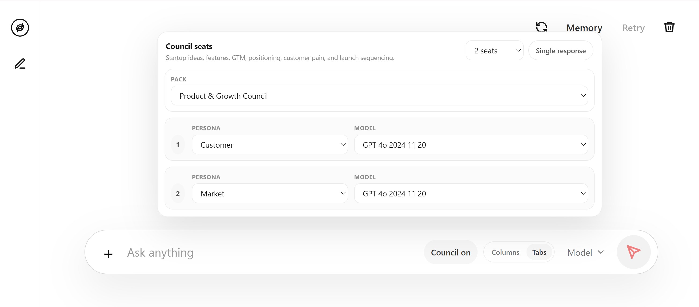

# OSS Conversation Agent



OSS Conversation Agent is a local-first ChatGPT-style conversation shell for building and testing modern AI assistants across provider APIs. It supports regular single-assistant chats, but its main workflow is Council mode: a small board of expert LLM personas that works through a decision from different operating viewpoints.

The product is designed around the core expectations of a serious chat agent: streamed responses, model selection, attachment upload and review, per-chat memory, markdown rendering, retry/regenerate flows, and response actions for copying or exporting answers.

## Council Mode



Council mode turns one prompt into a focused advisory board. Pick a pack, choose two or three seats, and assign each seat to the same model or to different models when you want provider or model diversity. Each persona is instructed to stay inside its assigned role and answer from that operating viewpoint only.

Council packs provide preset boards for common work:

- Executive Decision Board: Principles Partner, Risk Underwriter, and Operating Partner.
- Investment Committee: Capital Allocator, Diligence Lead, and Scenario Strategist.
- Product & Growth Council: Customer Advocate, Market Maker, and Execution Lead.

When a Council prompt is too thin for a useful answer, the Briefing Partner asks a short numbered question set first. The user can reply in free text, and the council receives both the raw wording and a normalized decision brief.

After the active personas respond, the Chairman Brief synthesizes their answers into a go-forward call with confidence, assumptions, risks, and next actions. The default model temperature is kept low so regenerate is closer to a repeatable decision review than a creative rewrite.

Council responses can be read in either layout:


Columns mode keeps the expert responses side by side for fast comparison.


Tabs mode reduces scroll and puts the Chairman Brief first, with each expert persona behind its own tab.

## Features

- Streaming assistant responses over server-sent events.
- Two- or three-seat Council mode with parallel persona response panes.
- Council packs with nine strict advisory personas across decision, investment, and product/growth work.
- Briefing Partner intake for underspecified council prompts.
- Chairman Brief synthesis from the active persona responses.
- Column and tab layouts for Council answers.
- Provider registry with dynamically refreshed OpenAI and OpenRouter model catalogs.
- Per-chat memory manager with inspectable and editable memory.
- File uploads with named attachment tiles and file-open links.
- OpenAI multimodal/file input support for images, PDFs, docs, text, code, CSV, and common office formats.
- OpenRouter image/text compatibility where supported by the selected model.
- Markdown rendering for headings, lists, links, code blocks, blockquotes, and tables.
- Response controls for copy, markdown download, and regenerate.
- Per-response input/output token usage when the provider returns usage data.
- Per-pane failure handling for provider errors during Council mode.
- Low default model temperature for more repeatable decision analysis.
- Dependency-free Node server and browser client.
- Local JSON persistence for conversations, messages, files, and memory.

## Models Available via OpenRouter, OpenAI, Ollama (local)


## Run Locally

Create a local env file:

```powershell
Copy-Item .env.example .env
```

Add your `OPENAI_API_KEY` and/or `OPENROUTER_API_KEY` to `.env`.

Start the app:

```powershell
node src/server/index.js
```

Open:

```text
http://127.0.0.1:4613
```

If provider keys are not set, the app runs in demo streaming mode so the interface and persistence can still be tested.

## Run With Docker

Create `.env` from the example file and add any provider keys:

```powershell
Copy-Item .env.example .env
```

Build and start:

```powershell
docker compose up --build
```

Open:

```text
http://127.0.0.1:4613
```

Compose mounts `./data` and `./uploads` into the container so conversations and uploaded files persist across restarts.

When running with Docker, the app is configured to reach Ollama on the host machine through `http://host.docker.internal:11434`. Override `DOCKER_OLLAMA_BASE_URL` if your Ollama server runs somewhere else:

```powershell
$env:DOCKER_OLLAMA_BASE_URL="http://192.168.1.20:11434"
docker compose up --build
```

## Provider Notes

OpenAI uses the Responses API and supports multimodal file input through the app's upload pipeline.

OpenRouter uses its OpenAI-compatible chat completions endpoint. Some models may reject attachments or multimodal content. When that happens, the app surfaces a user-friendly error built from the provider's actual response.

Ollama uses the local HTTP API. Outside Docker the default is `http://127.0.0.1:11434`; inside Docker Compose it is mapped to the host through `host.docker.internal`.

`MODEL_TEMPERATURE` controls sampling for provider calls. The default is `0.1`, which favors repeatability for decision work while still leaving the model enough room to produce useful structure.

## Project Structure

```text
src/client/      Browser UI
src/server/      Node server, providers, memory, uploads
docs/            Product imagery and docs assets
data/            Local runtime persistence, ignored
uploads/         Local uploaded files, ignored
```

## Status

This is an early product build intended for fast local iteration. The current implementation deliberately keeps dependencies low while the core product surface is being shaped.
